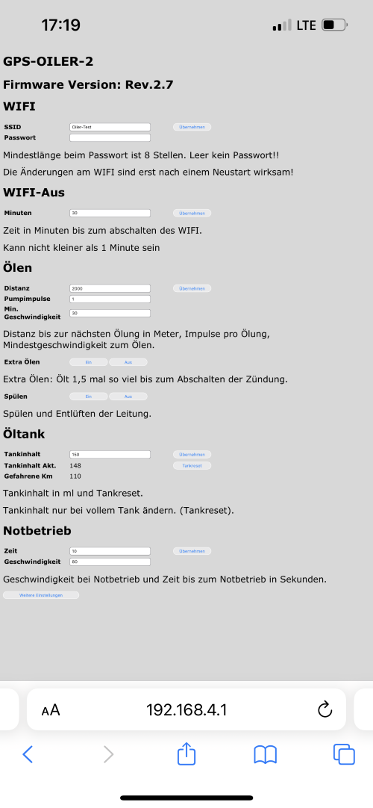

# Firmware Version 2.7

Hier wird der Kettenoiler mit der Firmware 2.7 Beschrieben.

Ich habe zwei Startbildschirme eingebaut die nach dem Einschalten angezeigt werden.

In 1. Startbildschirm wird mir die SSID des Kettenöler und die IP Adresse angezeigt (nachdem ich sie mal vergessen hatte ;-).

Im 2. die Version des Kettenöler und die Firmware Version.

Die Anzeigezeit lässt sich im Web Interface anpassen.

## Das OLED Display

### Erklärung obere Reihe von links nach rechts

-Die Kette wird gerade geölt.

-Regenmodus ist Aktiv.

-Satellitenempfang vorhanden.

-Anzahl der empfangenen Satelliten. Wenn die Anzahl der empfangenen Satelliten die Anzahl 9 übersteigt wird die Zehnerstelle anstelle des Satelliten Symbol angezeigt.

-Die ermittelte Geschwindigkeit.

### Untere Reihe•

-Gefahrene km seit dem letzten auffüllen.

-Die Himmelsrichtung in die man fährt

-Ganz unten befindet sich ein Balken der den berechneten Füllstand des Öltanks anzeigt.

### Browser

Um mit einem Browser das Web Interface nutzen zu können muss man als erstes das WIFI des Kettenölers in den Einstellungen des WIFI fähigen Gerät auswählen.

Anschließend gibt man im Browser die IP Adresse „192.168.4.1“ ein.

Jetzt sollte das Interface wie unten beschrieben zu sehen sein.

### Das Web Interface

Mit Hilfe des Web Interface kann man die Einstellungen des Kettenölers anzeigen lassen und wenn nötig anpassen.

## Startseite des Web Interface

### Wifi

Einstellung der SSID Kennung Einstellung des WIFI Passwort.

Wenn das Feld „Passwort“ keinen Eintrag hat, wird kein Passwort abgefragt.

### WIFI- Aus

Die Zeit in Minuten nach dem Einschalten und der letzten Eingabe über das Web Interface bis WIFI automatisch abgeschaltet wird.

### Ölen

Die Distanz zwischen den einzelnen Ölungen. Anzahl der Pumpimpulse pro Ölung.
Mindestgeschwindigkeit unter der das Ölen verhindert wird.

### Extra Ölen

Hier kann ich extra Ölen aktivieren. Durch das aktivieren wird der Abstand der einzelnen Ölungen um den Faktor 1,5 reduziert für den Fall das man z.b. auf Sandwegen unterwegs sein sollte. Das extra Ölen wird mit dem abschalten der Zündung automatisch deaktiviert.
Spülen
Der Kettenöler pumpt so lange bis Spülen wieder abgewählt oder die Zündung abgeschaltet wird.

### Öltank

Tankinhalt in ml.Aktueller Tankinhalt in ml.Gefahrene km seit „Übernehmen“ oder „Tankreset“.

### Notbetrieb

Wenn kein Sat-Empfang vorhanden ist, Zeit in Sekunden bis der Notbetrieb aktiviert wird. Bleibt so lange aktiv bis wieder Satellitenempfang vorhanden ist.
Angenommene Geschwindigkeit für den Notbetrieb.

### Weitere Einstellungen ( zweite Seite des Web Interface )

### Pumpe

Dauer in Millisekunden wie lange die Pumpe mit Spannung versorgt wird.
Dauer in Millisekunden wie lange die Pause zwischen zwei Pumpimpulsen mindestens sein soll.
Anzahl der Pumpimpulse die für 1 ml benötigt werden.

### Dauer Ölsymbol

Zeit in Sekunden wie lange das Ölen Symbol im OLED Display angezeigt wird.

### Anzeigezeit Startbildschirm

Zeit in Sekunden wie lange der Startbildschirm 1 nach dem Einschalten angezeigt werden soll.
Zeit in Sekunden wie lange der Startbildschirm 2 nach dem Einschalten angezeigt werden soll.

### Regenmodus

#### Ein

Schwellwert bei dem der Regenmodus aktiviert werden soll.

#### Aus

Schwellwert bei dem der Regenmodus wieder deaktiviert werden soll.
Der Schwellwerte für das Aktivieren des Regenmodus muss niedriger als der Schwellwert für das Deaktivieren des Regenmodus sein.

#### Richtung/Sensor

Hier kann ich wählen was ich im OLED angezeigt haben möchte. Entweder die Richtung in die ich gerade fahre oder der Wert des Regensensor. Das habe ich eingebaut damit ich einen besseren überblick von Regensensor haben kann.

#### Sensormittelwert

Hier wird der errechnete Sensormittelwert angezeigt.

#### Sensorwert

Aktueller Sensorwert.

#### Multiplikator

Multiplikator wie viel mehr bei Regen geölt werden soll. Er kann nicht kleiner als 1 eingestellt werden.

#### Pumpimpulse bei Regenmodus

Anzahl der Pumpimpulse nach dem Regenmodus. Dadurch soll das Öl das durch den Regen abgespült wurde wieder auf die Kette gebracht werden.

#### Gesamt Km und Pumpimpulse

Gesamt km

Hier werden die km angezeigt die insgesamt mit dem Kettenöler gefahren wurden.

Gesamt Pumpimpulse

Hier werden die Pumpimpulse angezeigt die insgesamt mit dem Kettenöler gepumpt wurden.
