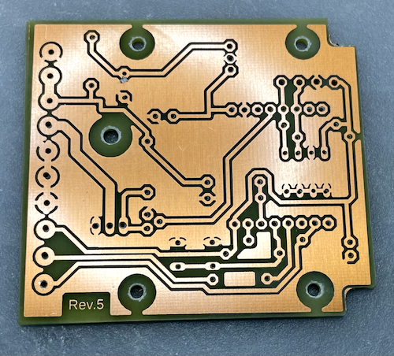
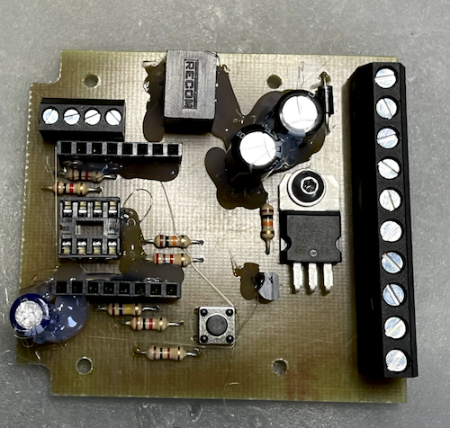
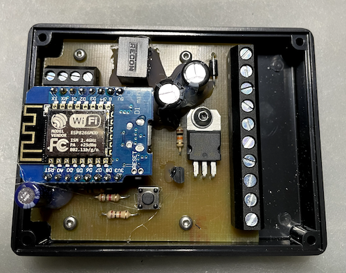

# Mainboard Rev.5

Der Nachbau und Einbau des Kettenöler und seiner Bauteile erfolgt auf eigenes Risiko und Verantwortung. Ich übernehme keine Haftung.

Hier beschreibe ich den Bau des Mainboard Rev..

## Benötigte Bauteile

### Widerstände

|Bezeichnung        |Beschreibung               |
|-------------------|---------------------------|
|R1                 |100Ω                       |
|R2,R5              |10KΩ                       |
|R3                 |2,7KΩ                      |
|R4                 |100kΩ                      |
R6,R7,R8            |1KΩ                        |

### Diode

|Bezeichnung        |Beschreibung               |
|-------------------|---------------------------|
|D1                 |1N4007                     |

### Kondensatoren

|Bezeichnung        |Beschreibung               |
|-------------------|---------------------------|
|C1                 |470µF/16V  RM 5mm  Elko    |
|C2                 |1500µF/6,3V RM 3,5  Elko   |

### Transistoren

|Bezeichnung        |Beschreibung               |
|-------------------|---------------------------|
|Q1                 |BUZ11A                     |
|Q2                 |BS170                      |

### Sonstiges

|Bezeichnung        |Beschreibung               |
|-------------------|---------------------------|
|DS R-78E50-05      |5V DC/DC Wandler           |
|S1                 |Kurzhubtaster 9302         |
|Controller         |Wemos D1 Mini              |
|GPS Modul          |Neo-6M                     |
|OLED Display       |SSD1306 Weiss I2C          |
|EEPROM             |24LC256-I/P                |
|IC Sockel          |GS 8                       |
|Gummidurchführung  |5x	KDF4                    |
|Klemmleiste 4fach  |AKL 059-4  Für das OLED    |
|Kunststoffgehäuse  |SP 2062 SW                 |
|Klemmleiste 10fach |AKL 101-10                 |
|Dosierpumpe        |Webasto oder ähnlich       |
|Kleine Schrauben   |4x (2,2x4,5mm)             |
|Schraube           |3mm mit Mutter             |
|Fotoplatine        |FPE1 160X100               |

Und alles was zum Herstellen einer Leiterplatte benötigt wird.
Ich habe zum Verbinden des GPS-Modul und dem OLED mit dem Mainboard ein USB Kabel verwendet. Das war günstiger.

Und hier mit aufgesetztem WEMOS und DC/DC Wandler. Hatte Probleme mit der Wärmeentwicklung.

Der Anschluss oben links ist vom OLED.

Der Taster ist zum zurücksetzen der WIFI Einstellung für den Fall das man sein WIFI Passwort vergessen haben sollte und nicht mehr rankommt.

## Anschlüsse

Masse       = Masse oder Minuspol

Klemme 15   = Zündung( Bei meiner Tracer der Stecker der Sitzbankheizung)

Pumpe       = Plus der Dosierpumpe

Pumpe       =   Minus der Dosierpumpe

3xGND       = GND für GPS,Regensensor.

VCC-2       = 3,3V für den GPS Modul

GPS-RX      = TX des GPS-Modul

Sensor      = Anschluss des Regensensor

## Vor der ersten Inbetriebnahme

Vor der ersten Inbetriebnahme unbedingt noch mal alles kontrollieren ob da alles richtig eingebaut wurde und keine Kurzschlüsse oder Unterbrechungen mehr vorhanden sind.

Wenn das erste mal Spannung angelegt wird, habe ich immer den WEMOS,OLED und das EEPROM abgezogen und erst einmal die Betriebsspannung 5V am WEMOS überprüft um zu sehen das der DC/DC Wandler auch seine 5V richtig ausgibt.

Wenn der Oiler das erste mal in Betrieb genommen wird, erkennt er daß das EEPROM noch unbeschrieben ist und beschreibt es dann mit den Werkseinstellungen automatisch.

Jetzt sollte alles funktionieren.

Es sollte jetzt etwas auf dem Display zu sehen ein. Wenn ja hat alles geklappt.

Glückwunsch!

Wenn nicht, geht die Fehlersuche los.

Sind die 3,3V am WEMOS vorhanden. Wenn nicht ist der WEMOS defekt.

Ist die 3,3V vorhanden, ist WIFI vorhanden. Wenn nicht, wurde die Firmware richtig aufgespielt?

Ist das OLED richtig angeschlossen?

Ist das OLED okay, ist GPS Empfang vorhanden? (kann bis 3 Min dauern. Dazu an einen Ort gehen wo auch Satellitenempfang möglich ist).

## Viel Erfolg beim Nachbau!

