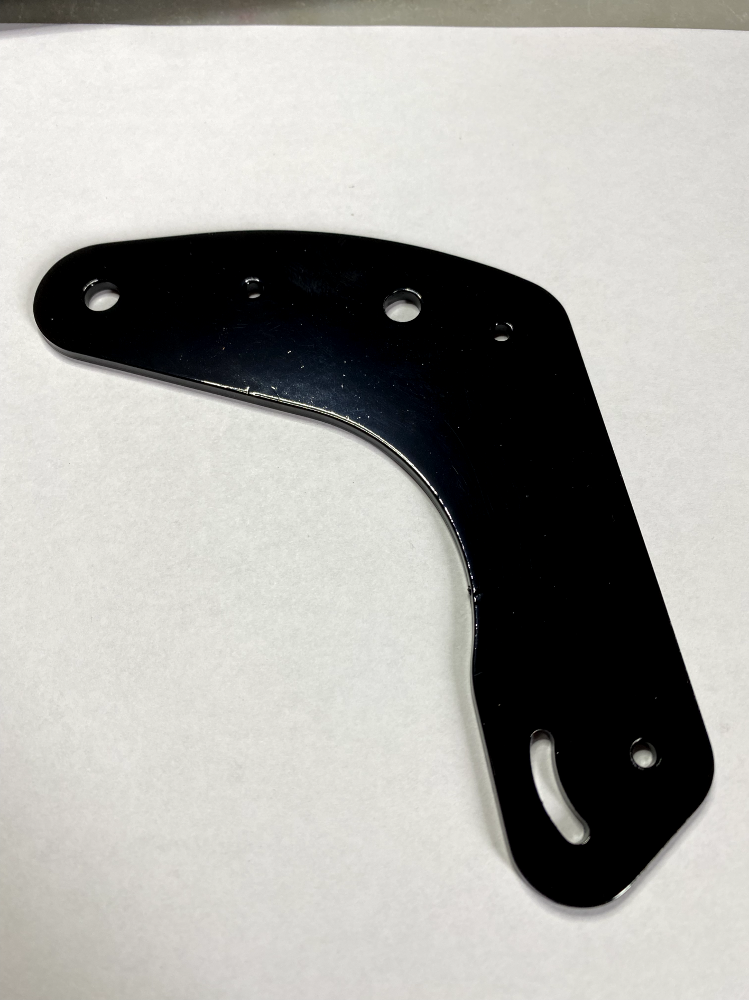

# Injector

## Der Injektor an meiner Tracer 900 GT

### !!Der Nachbau und Einbau des Injektor und seiner Bauteile erfolgt auf eigenes Risiko und Verantwortung.

### Ich übernehme keine Haftung

Da ich so wenig wie möglich vom Kettenöler sehen wollte habe ich mich dafür entschieden den Injektor an das vordere Kettenrad zu setzen.

## Das Halteblech für den Injector

Das Blech habe ich mit Hilfe einer CNC Fräse hergestellt.

