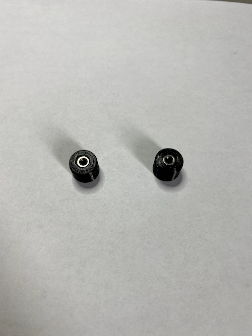

# Injector

## Der Injektor an meiner Tracer 900 GT

### !!Der Nachbau und Einbau des Injektor und seiner Bauteile erfolgt auf eigenes Risiko und Verantwortung.

### Ich übernehme keine Haftung

Da ich so wenig wie möglich vom Kettenöler sehen wollte habe ich mich dafür entschieden den Injektor an das vordere Kettenrad zu setzen.

## Das Halteblech für den Injector

Das Blech habe ich mit Hilfe einer CNC Fräse hergestellt.

Das Halteblech habe ich auf der Kettenseite etwas abgeschrägt damit die Kette auch wirklich nichts hat um daran hängen zu bleiben.

Hier sind die Haltenasen die ich mit einem 3D Drucker gedruckt habe

Blech mit Haltenasen

Kettenführung

Blech mit Kettenführung

Hier sind die beiden Führungsstifte und die Kettenführung mit dem Halteblech aus 3mm  Aluminium miteinander verbunden.
Dadurch wird später das ganze erst eimal in Position gehalten bis die Abdeckung das ganze zusammen hält.

Injector

Der aus PETG gedruckte Dual Injektor.

In den Injektorblock habe ich zwei Stückchen Silikonschlauch eingesetzt. Da hinein kommen dann die Röhrchen die dadurch im Block gehalten werden und das ganze schön Abgedichten.

Die Röschen habe ich aus dem Modellbau Zubehör (Bowdenzug).

Für den Schlauchanschluss dient ein stück Messingrohr.

Blech mit Injector

Halteblech mit Injector am Motorrad angesetzt

Durch die Langlöcher kann der Injector optimal justiert werden.

Mit der Änderung der Kunststoffröhrchen wird das Öl besser auf die Kette übertragen.

