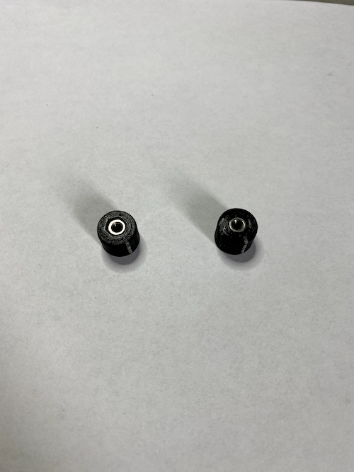
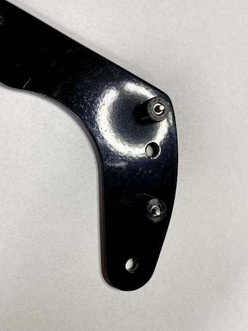
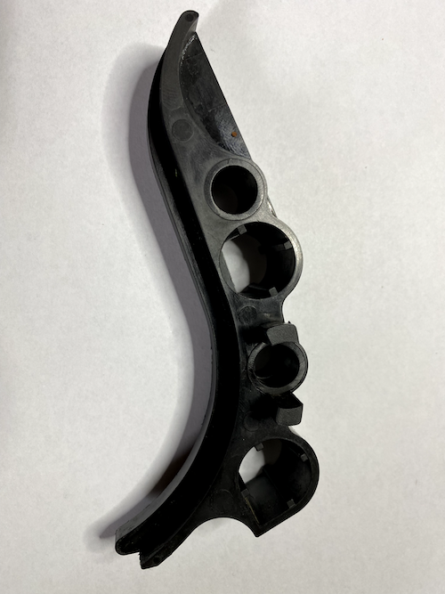
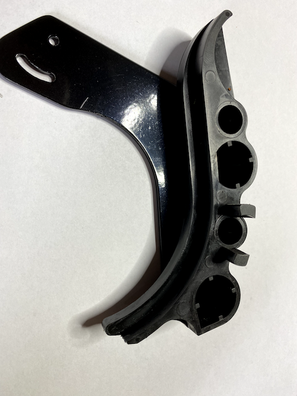
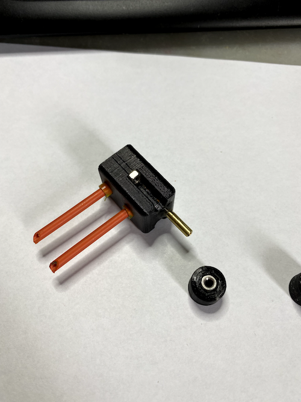
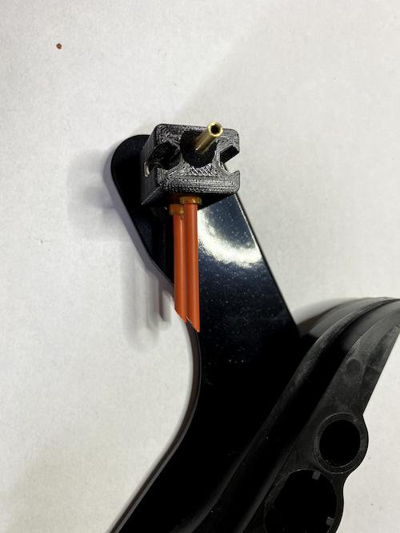
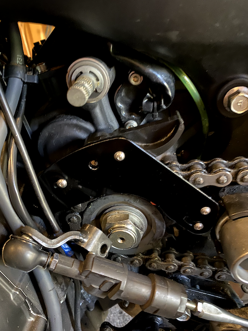
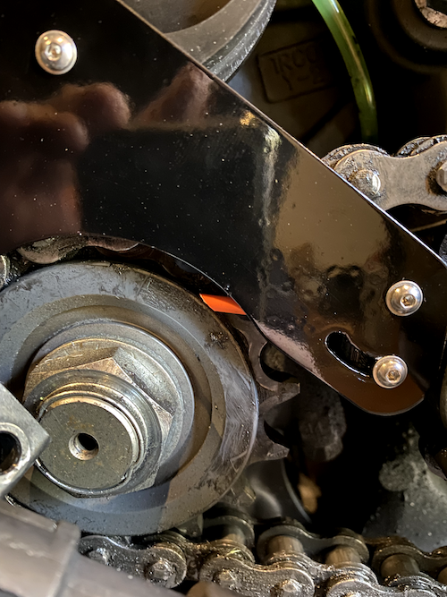
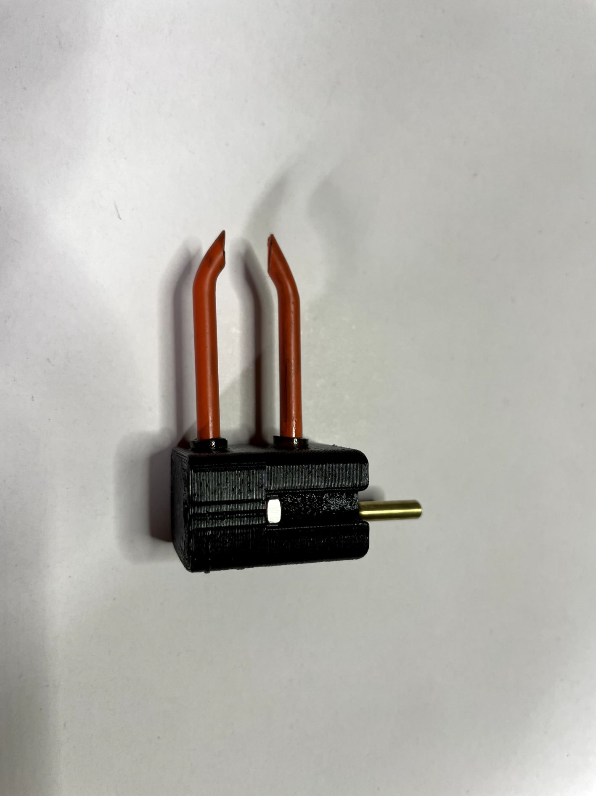

# Injector

## Der Injektor an meiner Tracer 900 GT

### !!Der Nachbau und Einbau des Injektor und seiner Bauteile erfolgt auf eigenes Risiko und Verantwortung.

### Ich übernehme keine Haftung

Da ich so wenig wie möglich vom Kettenöler sehen wollte habe ich mich dafür entschieden den Injektor an das vordere Kettenrad zu setzen.

## Das Halteblech für den Injector

Das Blech habe ich mit Hilfe einer CNC Fräse hergestellt.

Hier sind die Haltenasen die ich mit einem 3D Drucker gedruckt habe

Blech mit Haltenasen

Kettenführung

Blech mit Kettenführung

Injector

Der Kunststoffblock ist aus PETG Gedruckt und die Röhrchen sind mithilfe eines Tygon Schlauch im Block fest eingesetzt. Um den Injector zu Befestigen sind im Block 3mm Muttern eingesetzt.

Blech mit Injector

Halteblech mit Injector am Motorrad angesetzt

Durch die Langlöcher kann der Injector optimal justiert werden.

Mit der Änderung der Kunststoffröhrchen wird das Öl besser auf die Kette übertragen.

